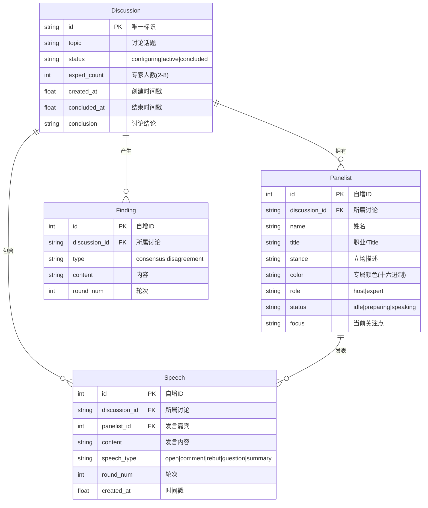
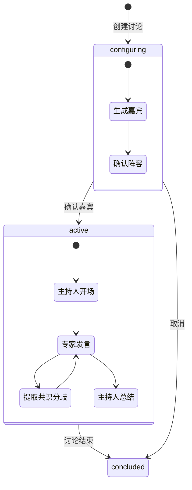

# 数据模型 ER 图

## 实体关系图

## 状态机

## 索引

| 索引名 | 表 | 列 | 用途 |
|--------|-----|-----|------|
| idx_panelists_discussion | panelists | discussion_id | 按讨论查嘉宾 |
| idx_speeches_discussion | speeches | discussion_id | 按讨论查发言 |
| idx_speeches_round | speeches | discussion_id, round_num | 按轮次查发言 |
| idx_findings_discussion | findings | discussion_id | 按讨论查发现 |
